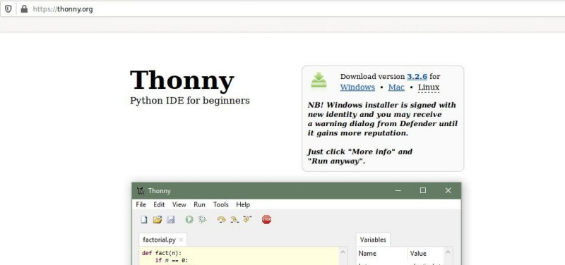
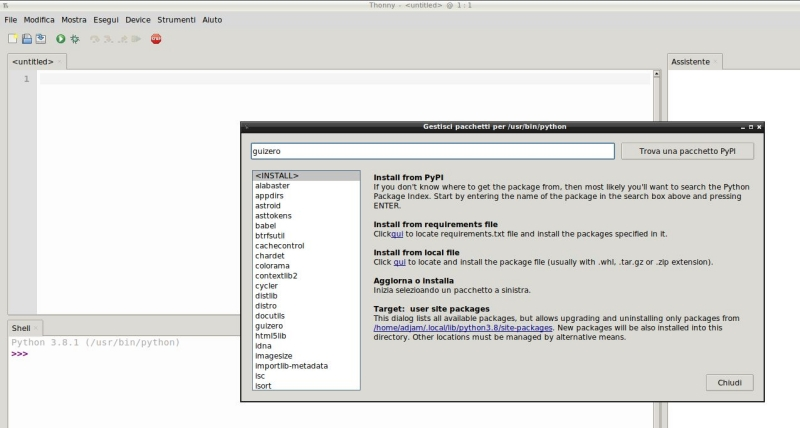

=============
Installazione
=============

La libreria guizero è stata progettata per permettere a chi la studia di imparare a creare velocemente delle GUI per i propri programmi.

Installare la libreria sul proprio sistema operativo è semplicissimo. Se siete utenti esperti vi basterà sapere che la libreria **GuiZero**
è disponibile su PyPi e si installa tramite pip, quindi da terminale basta digitare:

.. code:: bash
    
    $ pip3 install guizero

Se volete essere accompagnati su tutti i passaggi, vi dirò invece che noi lavoriamo in Python e lavoreremo sulla libreria GuiZero
utilizzando `Thonny <https://thonny.org>`_. 

Thonny è un ambiente di sviluppo integrato (Integrated Development Environment, IDE) pensato per i principianti che vogliono approcciare 
la programmazione con il linguaggio Python.

Installa in un solo colpo l’IDE (Thonny), il compilatore e interprete (Python) e tutte le librerie predefinite dell’ambiente; 
integra inoltre al suo interno una interfaccia semplice per il debug delle applicazioni e una interfaccia grafica (ancora più semplice) 
per l’accesso a PyPi (Python Package Index, https://pypi.org, il repository condiviso di tutte le librerie Python aggiuntive).

Installarlo è semplice come aprire il proprio browser preferito su https://thonny.org/, scegliere il pacchetto destinato 
al proprio sistema operativo e installarlo.

Scaricate dal sito indicato il pacchetto adatto al vostro sistema operativo e procedete alla sua installazione.

Una volta installato, aprite Thonny e procedete a scaricare la libreria GuiZero usufruendo dell'interfaccia semplice di Thonny per pip: dal
menù *STRUMENTI* ---> *GESTISCI I PACCHETTI* ---> *GUIZERO*:

Tutto qui!
