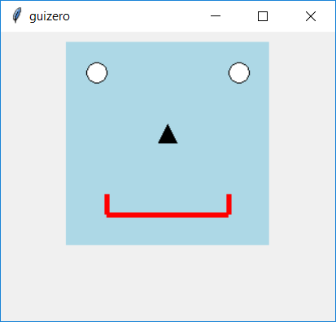

=======
Widgets
=======

Nei primi esempi abbiamo già visto 3 widgets disponibili nella libreria guizero: 

* la **App**, la classe che rappresenta la finestra principale di una applicazione, 

* la **Text**, che rappresenta una etichetta di testo, 

* la **PushButton** la classe che rappresenta un pulsante cliccabile.

In questo capitolo elencheremo tutte le widgets disponibili nella libreria guizero, elencando anche l'evento principale di ognuna di
esse, ovvero quello per cui la widget reagisce eseguendo la funzione eventualmente indicata con command.

App
===

La Finestra principale di una applicazione

.. image:: images/app.png

Box
===

Contenitore invisibile per organizzare il layout

.. image:: images/layout_boxes.png

ButtonGroup
===========

Gruppo di radio button (mutualmente esclusivi)

.. image:: images/buttongroup_windows.png

La funzione abbinata all'opzione *command* viene eseguita ogni volta che un radiobutton viene selezionato.

CheckBox
========

Casella spuntabile

.. image:: images/checkbox_windows.png

La funzione abbinata all'opzione *command* viene eseguita ogni volta che la casella viene spuntata, in un senso o nell'altro.

Combo
=====

Menù a discesa per selezionare una opzione

.. image:: images/combo_windows.png

La funzione abbinata all'opzione *command* viene eseguita ogni volta che viene selezionata un'opzione del menù a tendina.
Può prendere come parametro il valore selezionato della combo.

Drawing
=======

Area per il disegno vettoriale

ListBox
=======

Lista generica di elementi

.. image:: images/listbox_windows.png

La funzione abbinata all'opzione *command* viene eseguita ogni volta che un elemento della lista viene selezionato.
Può prendere come parametro il valore selezionato della ListBox.

MenuBar
=======

Barra dei Menù.

.. image:: images/menubar_windows.png

Picture
=======

Contenitore per immagini

.. image:: images/picture_windows.png

PushButton
==========

Pulsante cliccabile

.. image:: images/pushbutton_windows.png

La funzione abbinata all'opzione *command* viene eseguita ogni volta che il pulsante viene cliccato.

Slider
======

Selettore a barra di scorrimento. Può essere impostato in senso orizzontale o verticale.

.. image:: images/slider_windows.png

La funzione abbinata all'opzione *command* viene eseguita ogni volta che la barra viene spostata.
Può prendere come parametro il valore attuale dello slider.

Text
====

Etichetta di testo (ci scrive il programmatore)

.. image:: images/text_windows.png

TextBox
=======

Casella di testo (ci scrive l'utente)

.. image:: images/textbox_windows.png

La funzione abbinata all'opzione *command* viene eseguita ogni volta che il testo al suo interno viene modificato.
Può prendere come parametro il valore attuale della TextBox.

Waffle
======

Griglia di quadrati (Misteriosa, ai miei occhi)

.. image:: images/waffle_windows.png

La funzione abbinata all'opzione *command* viene eseguita ogni volta che il testo in uno dei suoi quadrati viene modificato.

Window
======

Finestra secondaria di una applicazione

.. image:: images/window.png

