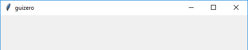
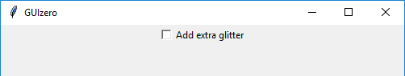
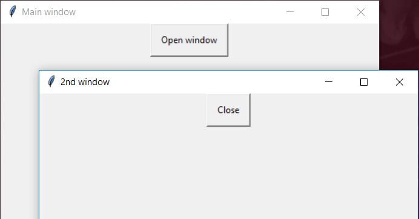

=======
Widgets
=======

Nei primi esempi abbiamo già visto 3 widgets disponibili nella libreria guizero: 

* la **App**, la classe che rappresenta la finestra principale di una applicazione, 

* la **Text**, che rappresenta una etichetta di testo, 

* la **PushButton** la classe che rappresenta un pulsante cliccabile.

In questo capitolo elencheremo tutte le widgets disponibili nella libreria guizero, elencando anche l'evento principale di ognuna di
esse, ovvero quello per cui la widget reagisce eseguendo la funzione eventualmente indicata con command.

============ ================================================ =================
Widget       Descrizione                                      Evento principale
============ ================================================ =================
App          La Finestra principale di una applicazione
Box          Contenitore invisibile per organizzare il layout
ButtonGroup  Gruppo di radio button (mutualmente esclusivi)   Selezione di uno
CheckBox     Casella spuntabile                               Spunta
Combo        Menù a discesa per selezionare una opzione       Selezione
Drawing      Area per il disegno vettoriale
ListBox      Lista generica di elementi                       Click su una voce
MenuBar      Barra dei Menù. 
Picture      Contenitore per immagini
PushButton   Pulsante cliccabile                              Click
Slider       Selettore a barra di scorrimento                 Scorrimento
Text         Etichetta di testo (ci scrive il programmatore)
TextBox      Casella di testo (ci scrive l'utente)            Scrittura
Waffle       Griglia di quadrati (Misteriosa, ai miei occhi)
Window       Finestra secondaria di una applicazione
============ ================================================ =================

App
===

La Finestra principale di una applicazione

Box
===

Contenitore invisibile per organizzare il layout

.. image:: images/layout_boxes.png

ButtonGroup
===========

Gruppo di radio button (mutualmente esclusivi)

CheckBox
========

Casella spuntabile

Combo
=====

Menù a discesa per selezionare una opzione

Drawing
=======

Area per il disegno vettoriale

.. image:: images/drawing_windows.png

ListBox
=======

Lista generica di elementi

MenuBar
=======

Barra dei Menù.

.. image:: images/menubar_windows.png

Picture
=======

Contenitore per immagini

.. image:: images/picture_windows.png

PushButton
==========

Pulsante cliccabile

.. image:: images/pushbutton_windows.png

Slider
======

Selettore a barra di scorrimento

Text
====

Etichetta di testo (ci scrive il programmatore)

.. image:: images/text_windows.png

TextBox
=======

Casella di testo (ci scrive l'utente)

.. image:: images/textbox_windows.png

Waffle
======

Griglia di quadrati (Misteriosa, ai miei occhi)

.. image:: images/waffle_windows.png

Window
======

Finestra secondaria di una applicazione

