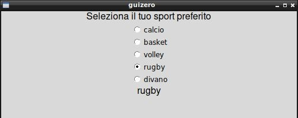
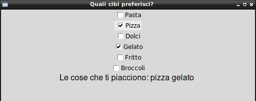
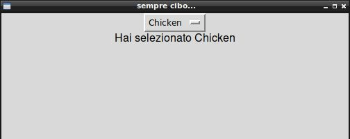
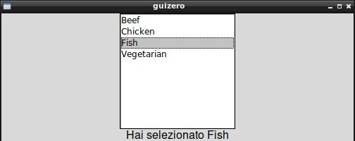
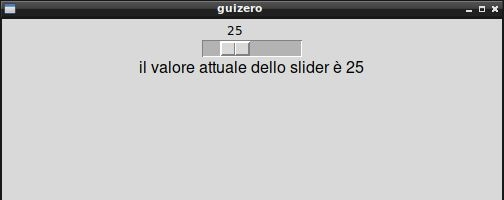

===========================
Esempi ed Esercizi semplici
===========================

Ci sono Widgets che richiedono la conoscenza di ulteriori concetti prima di essere utilizzate, come ad esempio le widgets Box, MenuBar, Waffle e Window. 

In questa prima sequenza di esempi ed esercizi prenderemo confidenza con le widgets più semplici, partendo da un esempio e provando con esercizi 
che introducono piccole modifiche. Le nostre applicazioni non faranno molto, ma alla fine di questa prima carrellata speriamo di avere le idee più chiare su quello su cui stiamo lavorando.

Se hai bisogno di suggerimenti, ricorda che hai a che fare con delle semplici classi: consulta la sezione **GuiZero Docs** relativa all'oggetto che 
stai utilizzando per informazioni sui suoi metodi e sui suoi attributi.

Iniziamo!

App, PushButton, TextBox
========================

Nell'esempio iniziale l'utente può inserire una frase nella linea di testo; quando clicca il pulsante la TextBox si resetta e si modifica il
titolo della finestra.

.. code:: python

    from guizero import App, PushButton, TextBox

    def cambiaTitolo():
        app.title = testo.value
        testo.value = ""

    app = App()
    testo = TextBox(app)
    pulsante = PushButton(app,
                          text="Inserisci un titolo e clicca il pulsante", 
                          command=cambiaTitolo)
    app.display()

.. image:: esempi/es000.jpg

**Esercizio 001 (PushButton)**

Creare una applicazione con una finestra con titolo *Ciccio* che contiene un pulsante. Quando clicchi il pulsante, il titolo
diventa *Pippo*, quando lo clicchi di nuovo ritorna ad essere *Ciccio* e così via.

**Esercizio 002 (PushButton, Text, TextBox)**

Creare una applicazione con una finestra che contiene una Text, inizialmente vuota, una TextBox e un pulsante. Quando l'utente
clicca sul pulsante, il testo contenuto nella TextBox viene copiato nella Text e la TextBox ripulita.

**Esercizio 003 (PushButton)**

Creare una applicazione con un pulsante *CHIUDI*. Quando lo clicchi, l'applicazione si chiude.

ButtonGroup
===========

Nell'esempio che segue abbiamo una lista di voci nella ButtonGroup da cui selezionare una (e una sola voce) che sarà visualizzata nella Text sotto.

.. code:: python

    from guizero import App, ButtonGroup, Text

    def update_text():
        voceSelezionata.value = activities.value

    app = App()
    Text(app,"Seleziona il tuo sport preferito")
    activities = ButtonGroup(app,
                            options=["calcio", "basket", "volley", "rugby","divano"],
                            command=update_text)

    voceSelezionata = Text(app, text=".....")
    app.display()

**Esercizio 011 (ButtonGroup, Text)**

Testare il codice precedente, cambiando la domanda iniziale in *Dimmi come vieni a scuola*, nell'elenco delle opzioni ci devono essere una serie
di mezzi di trasporto con cui è possibile si venga a scuola. Nella stringa in basso, alla selezione del mezzo di trasporto, deve apparire la scritta:
*vieni a scuola in MEZZODITRASPORTO*.

**Esercizio 012 (TextBox, ButtonGroup, PushButton, Text)**

Applicazione con una TextBox per inserire il nome e un ButtonGroup per selezionare il sesso (opzioni *Maschio*, *Femmina*) più un pulsante e una Text.
Al click sul pulsante va visualizzata nella Text la scritta *Buongiorno signor NOME* oppure *Buongiorno signora NOME* a seconda del sesso selezionato.

Come ulteriore difficoltà si può aggiungere il controllo dell'ora: se il pulsante viene cliccato fra le 6 e le 14, si utilizza *Buongiorno*, fra le 14 e le 22
si scrive *Buonasera*, fra le 22 e le 6 si scrive *Buonanotte*.

**Esercizio 013 (TextBox, ButtonGroup, PushButton)**

Applicazione con una TextBox e un pulsante. L'utente scrive una serie di parole separate da virgola nella TextBox e quando preme il pulsante appare
un ButtonGroup con le opzioni indicate nella TextBox e separate da virgole.

CheckBox
========

Nell'esempio seguente l'utente seleziona i suoi piatti preferiti e man mano che seleziona si aggiorna la lista sulla Text in fondo.

.. code:: python

    from guizero import App, Text, CheckBox

    def visualizzaCibiPreferiti():
        frase = "Le cose che ti piacciono: "
        if pasta.value == True:
            frase += "pasta "
        if pizza.value == True:
            frase += "pizza "
        if dolci.value == True:
            frase += "dolci "
        if gelato.value == True:
            frase += "gelato "
        if fritto.value == True:
            frase += "fritto "
        if broccoli.value == True:
            frase += "broccoli "
        
        cosaSiMangia.value = frase
            

    app = App(title="Quali cibi preferisci?")

    pasta = CheckBox(app, text="Pasta", command=visualizzaCibiPreferiti)
    pizza = CheckBox(app, text="Pizza", command=visualizzaCibiPreferiti)
    dolci = CheckBox(app, text="Dolci", command=visualizzaCibiPreferiti)
    gelato = CheckBox(app, text="Gelato", command=visualizzaCibiPreferiti)
    fritto = CheckBox(app, text="Fritto", command=visualizzaCibiPreferiti)
    broccoli = CheckBox(app, text="Broccoli", command=visualizzaCibiPreferiti)

    cosaSiMangia = Text(app, text="")

    app.display()

**Esercizio 021 (Text, CheckBox)**

Reimplementa lo stesso esercizio dell'esempio, partendo però da una tupla che contiene l'elenco dei cibi da controllare e da un dizionario
inizialmente vuoto, che in ogni elemento conterrà come chiave il nome del cibo e come valore la CheckBox abbinata ad esso.

**Esercizio 022 ()**

A

**Esercizio 023 ()**

A

Combo
=====

Continuiamo con gli esempi culinari... seleziona un cibo che viene visualizzato nella Text sottostante

.. code:: python

    from guizero import App, Combo, Text
    
    def visualizzaCibo(cibo):
        testo.value = "Hai selezionato " + cibo
        return
        
    app = App(title="sempre cibo...")
    combo = Combo(app, 
                    options=["Beef", "Chicken", "Fish", "Vegetarian"],
                    command=visualizzaCibo)
    testo = Text(app)
    
    app.display()

**Esercizio 031 ()**

A

**Esercizio 032 ()**

A

**Esercizio 033 ()**

A

ListBox
=======

Analogo esempio della combo, stavolta applicato ad una ListBox: quando selezioni un cibo si aggiorna il contenuto della Text.

.. code:: python

    from guizero import App, ListBox, Text

    def visualizzaCibo(cibo):
        testo.value = "Hai selezionato " + cibo
        return

    app = App()
    listbox = ListBox(app, 
                        items=["Beef", "Chicken", "Fish", "Vegetarian"],
                        command=visualizzaCibo)
    testo = Text(app)
    
    app.display()

**Esercizio 041 (ListBox, PushButton, Text)**

Inserite nella App una ListBox con una sequenza di voci e la possibilità di selezionarne contemporaneamente più di una. Quando l'utente clicca il pulsante
nella Text vengono visualizzate tutte le voci selezionate.

**Esercizio 042 (ListBox, PushButton)**

Inserite nella App una ListBox vuota e un pulsante. Quando l'utente clicca il pulsante, il programma carica dal file *dati.txt* presente nella stessa cartella
(dovete crearlo voi, con una parola ogni riga: ogni riga del file diventerà una voce nella ListBox). 

**Esercizio 043 (ListBox)**

con una voce selezionata

Slider
======

.. code:: python

    from guizero import App, Slider, Text
    
    def slider_changed(slider_value):
        testo.value = "il valore attuale dello slider è " + slider_value

    app = App()
    slider = Slider(app, command=slider_changed)
    testo = Text(app)
    
    app.display()

**Esercizio 051 ()**

A

**Esercizio 052 ()**

A

**Esercizio 053 ()**

A
