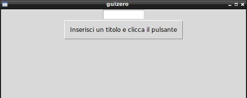

===========================
Esempi ed Esercizi semplici
===========================

Ci sono Widgets che richiedono la conoscenza di ulteriori concetti prima di essere utilizzate, come ad esempio le widgets Box, MenuBar, Waffle e Window. 

In questa prima sequenza di esempi ed esercizi prenderemo confidenza con le widgets più semplici, partendo da un esempio e provando con esercizi 
che introducono piccole modifiche. Le nostre applicazioni non faranno molto, ma alla fine di questa prima carrellata speriamo di avere le idee più chiare su quello su cui stiamo lavorando.

Se hai bisogno di suggerimenti, ricorda che hai a che fare con delle semplici classi: consulta la sezione **GuiZero Docs** relativa all'oggetto che 
stai utilizzando per informazioni sui suoi metodi e sui suoi attributi.

Iniziamo!

App, PushButton, TextBox
========================

Nell'esempio iniziale l'utente può inserire una frase nella linea di testo; quando clicca il pulsante la TextBox si resetta e si modifica il
titolo della finestra.

.. code:: python

    from guizero import App, PushButton, TextBox

    def cambiaTitolo():
        app.title = testo.value
        testo.value = ""

    app = App()
    testo = TextBox(app)
    pulsante = PushButton(app,
                          text="Inserisci un titolo e clicca il pulsante", 
                          command=cambiaTitolo)
    app.display()

**Esercizio 001 (PushButton)**

Creare una applicazione con una finestra con titolo *Ciccio* che contiene un pulsante. Quando clicchi il pulsante, il titolo
diventa *Pippo*, quando lo clicchi di nuovo ritorna ad essere *Ciccio* e così via.

**Esercizio 002 (PushButton, Text, TextBox)**

Creare una applicazione con una finestra che contiene una Text, inizialmente vuota, una TextBox e un pulsante. Quando l'utente
clicca sul pulsante, il testo contenuto nella TextBox viene copiato nella Text e la TextBox ripulita.

**Esercizio 003 (PushButton)**

Creare una applicazione con un pulsante *CHIUDI*. Quando lo clicchi, l'applicazione si chiude.

ButtonGroup
===========

Nell'esempio che segue abbiamo una lista di voci nella ButtonGroup da cui selezionare una (e una sola voce) che sarà visualizzata nella Text sotto.

.. code:: python

    from guizero import App, ButtonGroup, Text

    def update_text():
        voceSelezionata.value = activities.value

    app = App()
    Text(app,"Seleziona il tuo sport preferito")
    activities = ButtonGroup(app,
                            options=["calcio", "basket", "volley", "rugby","divano"],
                            command=update_text)

    voceSelezionata = Text(app, text=".....")
    app.display()

**Esercizio 011 (ButtonGroup, Text)**

Testare il codice precedente, cambiando la domanda iniziale in *Dimmi come vieni a scuola*, nell'elenco delle opzioni ci devono essere una serie
di mezzi di trasporto con cui è possibile si venga a scuola. Nella stringa in basso, alla selezione del mezzo di trasporto, deve apparire la scritta:
*vieni a scuola in MEZZODITRASPORTO*.

**Esercizio 012 (TextBox, ButtonGroup, PushButton, Text)**

Applicazione con una TextBox per inserire il nome e un ButtonGroup per selezionare il sesso (opzioni *Maschio*, *Femmina*) più un pulsante e una Text.
Al click sul pulsante va visualizzata nella Text la scritta *Buongiorno signor NOME* oppure *Buongiorno signora NOME* a seconda del sesso selezionato.

Come ulteriore difficoltà si può aggiungere il controllo dell'ora: se il pulsante viene cliccato fra le 6 e le 14, si utilizza *Buongiorno*, fra le 14 e le 22
si scrive *Buonasera*, fra le 22 e le 6 si scrive *Buonanotte*.

**Esercizio 013 (TextBox, ButtonGroup, PushButton)**

Applicazione con una TextBox e un pulsante. L'utente scrive una serie di parole separate da virgola nella TextBox e quando preme il pulsante appare
un ButtonGroup con le opzioni indicate nella TextBox e separate da virgole.

CheckBox
========

Nell'esempio seguente l'utente seleziona i suoi piatti preferiti e man mano che seleziona si aggiorna la lista sulla Text in fondo.

.. code:: python

    from guizero import App, Text, CheckBox

    def visualizzaCibiPreferiti():
        frase = "Le cose che ti piacciono: "
        if pasta.value == True:
            frase += "pasta "
        if pizza.value == True:
            frase += "pizza "
        if dolci.value == True:
            frase += "dolci "
        if gelato.value == True:
            frase += "gelato "
        if fritto.value == True:
            frase += "fritto "
        if broccoli.value == True:
            frase += "broccoli "
        
        cosaSiMangia.value = frase
            

    app = App(title="Quali cibi preferisci?")

    pasta = CheckBox(app, text="Pasta", command=visualizzaCibiPreferiti)
    pizza = CheckBox(app, text="Pizza", command=visualizzaCibiPreferiti)
    dolci = CheckBox(app, text="Dolci", command=visualizzaCibiPreferiti)
    gelato = CheckBox(app, text="Gelato", command=visualizzaCibiPreferiti)
    fritto = CheckBox(app, text="Fritto", command=visualizzaCibiPreferiti)
    broccoli = CheckBox(app, text="Broccoli", command=visualizzaCibiPreferiti)

    cosaSiMangia = Text(app, text="")

    app.display()

.. image:: esempi/es020.jpg

**Esercizio 021 (Text, CheckBox)**

Reimplementa lo stesso esercizio dell'esempio, partendo però da una tupla che contiene l'elenco dei cibi da controllare e da un dizionario
inizialmente vuoto, che in ogni elemento conterrà come chiave il nome del cibo e come valore la CheckBox abbinata ad esso.

**Esercizio 022 (Text, CheckBox)**

Identico all'esercizio precedente, ma la Text non visualizza il testo delle CheckBox selezionate ma il numero di queste. Ad esempio all'inizio
vi sarà scritto "0 CheckBox selezionate" e il numero crescerà o diminuirà a seconda che vengono attivate o no le CheckBox.

**Esercizio 023 (PushButton, CheckBox)**

la finestra contiene 3 pulsanti: il primo massimizza la finestra, il secondo la iconizza sulla barra delle applicazioni, il terzo la chiude.
Sotto i pulsanti ci sono 3 CheckBox che corrispondono ognuna ad un pulsante: se la CheckBox è spuntata, il pulsante corrispondente è abilitato,
altrimenti è disabilitato. Fate attenzione a sincronizzare la spunta sulla CheckBox con l'abilitazione del pulsante corrispondente e viceversa.

Combo
=====

Continuiamo con gli esempi culinari... seleziona un cibo che viene visualizzato nella Text sottostante

.. code:: python

    from guizero import App, Combo, Text
    
    def visualizzaCibo(cibo):
        testo.value = "Hai selezionato " + cibo
        return
        
    app = App(title="sempre cibo...")
    combo = Combo(app, 
                    options=["Beef", "Chicken", "Fish", "Vegetarian"],
                    command=visualizzaCibo)
    testo = Text(app)
    
    app.display()

.. image:: esempi/es030.jpg

**Esercizio 031 (TextBox, PushButton, Combo)**

La finestra presenta una TextBox, un pulsante e una Combo, inizialmente con un'unica opzione (un testo a piacere). L'utente inserisce una stringa nella TextBox
e se non è vuota, quando clicca il pulsante quella stringa viene aggiunta come opzione alla Combo e la TextBox ripulita.

**Esercizio 032 (App, Combo)**

la finestra presenta una Combo con opzioni '600x400', '800x600', 'massimizza'. Quando l'utente seleziona una delle opzioni la finestra si ridimensiona secondo quanto
indicato.

**Esercizio 033 (App, Combo, CheckBox)**

Dichiarate una tupla di valori qualsiasi e con essa create sia una Combo che elenca tutti gli elementi della tupla, sia una serie di CheckBox, una per ogni valore
della tupla. Quando l'utente seleziona uno dei valori della Combo la CheckBox corrispondente cambia stato, venendo spuntata oppure no a seconda del suo stato
precedente.

ListBox
=======

Analogo esempio della combo, stavolta applicato ad una ListBox: quando selezioni un cibo si aggiorna il contenuto della Text.

.. code:: python

    from guizero import App, ListBox, Text

    def visualizzaCibo(cibo):
        testo.value = "Hai selezionato " + cibo
        return

    app = App()
    listbox = ListBox(app, 
                        items=["Beef", "Chicken", "Fish", "Vegetarian"],
                        command=visualizzaCibo)
    testo = Text(app)
    
    app.display()

**Esercizio 041 (ListBox, PushButton, Text)**

Inserite nella App una ListBox con una sequenza di voci e la possibilità di selezionarne contemporaneamente più di una. Quando l'utente clicca il pulsante
nella Text vengono visualizzate tutte le voci selezionate.

**Esercizio 042 (ListBox, TextBox, PushButton)**

Inserite nella App una ListBox inizialmente vuota, una TextBox e un PushButton. L'utente digita qualcosa nella TextBox e quando clicca il pulsante, se la TextBox
non è vuota, aggiunge la parola alla ListBox e pulisce la TextBox.

**Esercizio 043 (ListBox, PushButton)**

Inserite nella App una ListBox vuota e un pulsante. Quando l'utente clicca il pulsante, il programma carica dal file *dati.txt* presente nella stessa cartella
(dovete crearlo voi, con una parola ogni riga: ogni riga del file diventerà una voce nella ListBox). 

Slider
======

.. code:: python

    from guizero import App, Slider, Text
    
    def slider_changed(slider_value):
        testo.value = "il valore attuale dello slider è " + slider_value

    app = App()
    slider = Slider(app, command=slider_changed)
    testo = Text(app)
    
    app.display()

**Esercizio 051 (App, Slider, Text)**

Inserite nella App uno Slider che va da 1 a 10 e aggiungete una Text che visualizza il suo valore aggiornato in tempo reale.

**Esercizio 052 (App, TextBox, PushButton, Slider)**

Inserite nella App due coppie TextBox/PushButton. La prima coppia decide il valore minimo dello Slider, la seconda coppia il valore massimo. I pulsanti aggiornano
lo stato dello Slider.

**Esercizio 053 (App, Slider, PushButton)**

Inserite nella App due Slider, uno che va da 200 a 800 per la larghezza e uno che va da 100 a 500 per l'altezza. L'utente muove gli slider a piacimento e quando
clicca il pulsante si modifica la dimensione della finestra.
