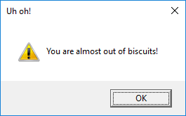

=======
Pop-ups
=======

Le finestre pop-up sono finestre modali utilizzate per interrompere l'utente e mostrargli o chiedergli una informazione ritenuta importante dall'applicazione.

.. image:: images/alert_info_windows.png

I Pop-ups possono essere chiamati da un oggetto `App` oppure `Window`:

.. code:: python

    app.info("info", "this is a guizero app")

    
oppure importate individualmene e utilizzate secondo necessità:

.. code:: python
    
    from guizero import info
    info("info", "this is a guizero app")

Tipologie di Pop-ups
====================

Vediamo l'elenco completo dei pop-up disponibili su GuiZero:

* ``warn(title, text)`` - popup box con una icona di warning

* ``info(title, text)`` - popup box con una icona informativa

* ``error(title, text)`` - popup box con una icona di errore

* ``yesno(title, text)`` - popup box con opzioni yes/no. `Yes` ritorna `True`, `No` ritorna `False`.

* ``question(title, text, initial_value=None)`` - popup box con il testo per una domanda a cui si può rispondere scrivendo testo. Se premi `Ok` ritorna il valore 
  digitato, se premi `Cancel` ritorna `None`.

* ``select_file(title="Select file", folder=".", filetypes=[["All files", "*.*"]], save=False)`` - popup box per selezionare un file da aprire. 
  Se imposti `save` a `True` sarà per selezioare un percorso su cui salvare. Il `path` del file selezionato viene ritornato dalla funzione.

* ``select_folder(title="Select folder", folder=".")`` - popup box per selezionare una directory. Il `path` selezionato viene ritornato dalla funzione.

Tutte queste popup usano il look nativo del sistema operativo che le ospita, quindi sembreranno differenti su ogni sistema operativo ma coerenti con lo stesso.

Esempi
======

Warning box
-----------

Apre un messaggio di Warning con titolo \\"Uh oh!\\" e il messaggio \\"You are almost out of biscuits!\\".

.. code:: python

    from guizero import App
    app = App(title="Biscuit monitor")
    app.warn("Uh oh!", "You are almost out of biscuits!")
    app.display()

Su Windows, dovrebbe essere una cosa tipo questa:

I Pop-ups `info` e `error` funzionano esattamente nello stesso modo ma visualizzano icone diverse, per indicare messaggi di tenore diverso.

Yes/No box
----------

Questo popup ritorna un valore booleano:

* Se premi `Yes`, ritorna `True`

* Se premi `No`, ritorna `False`

Basta memorizzare questo valore in una variabile e controllarla (ad esempio con un if):

.. code:: python

    from guizero import App
    app = App(title="Snowman")
    build_a_snowman = app.yesno("A question...", "Do you want to build a snowman?")
    if build_a_snowman == True:
        app.info("Snowman", "It doesn't have to be a snowman")
    else:
        app.error("Snowman", "Okay bye...")
    app.display()

Questo codice prima visualizza la Yes/No box

Se premi `Yes`

.. image:: images/info_windows.png

Se premi `No`

.. image:: images/error_windows.png

Esempio: utilizzare un alert come **callback**
----------------------------------------------

Ciascuna di queste caselle può essere utilizzata in una funzione ``callback`` (cioè quando devi implementare una funzione che un'altra widget deve chiamare).
In questo semplice esempio, quando premi un pulsante appare un messaggio informativo:

.. code:: python

    from guizero import App, PushButton, info
    app = App()
    button = PushButton(app, command=app.info, args=["Info", "You pressed the button"])
    app.display()

Gli argomenti forniti al pulsante sono:

* il nome della funzione da chiamare quando premuto: (`command=app.info`)

* la lista degli argomenti necessari alla funzione che vuoi chiamare (in questo caso, il valore per il titolo e il messaggio informativo)

Esempio: Do you really want to close?
-------------------------------------

Si può utilizzare una `yesno` box per verificare che qualcuno voglia realmente uscire dalla tua App. Se cliccano `yes`, la app si chiude, altrimenti si ritorna 
normalmente alla App.

.. code:: python
    
    from guizero import App, Text

    # Ask the user if they really want to close the window
    def do_this_when_closed():
        if app.yesno("Close", "Do you want to quit?"):
            app.destroy()

    app = App()

    title = Text(app, text="blank app")

    # When the user tries to close the window, run the function do_this_when_closed()
    app.when_closed = do_this_when_closed

    app.display()

Esempio: fare una domanda
-------------------------

Si può utilizzare un pop-up `question` per richiedere una informazione all'utente (in questo esempio, il nome):

.. code:: python
    
    from guizero import App, PushButton, Text

    def button_pressed():
        name = app.question("Hello", "What's your name?")
        # If cancel is pressed, None is returned
        # so check a name was entered
        if name is not None:
            hello.value = "Hello " + name

    app = App()
    button = PushButton(app, command=button_pressed, text="Hello")
    hello = Text(app)
    app.display()

.. image:: images/question_windows.png

Esempio: selezionare un file
----------------------------

Chiedere all'utente di selezionare un file tramite la `select_file` pop-up.

.. code:: python
    
    from guizero import App, PushButton, Text

    def get_file():
        file_name.value = app.select_file()

    app = App()

    PushButton(app, command=get_file, text="Get file")
    file_name = Text(app)

    app.display()

Si può anche aggiungere un filtro per certi tipi di file. Nel prossimo esempio verranno mostrati solo documenti *.txt*:

.. code:: python
    
    file_name.value = app.select_file(filetypes=[["All files", "*.*"], ["Text documents", "*.txt"]])

Normalmente viene mostrato un pulsante *Open*. Per visualizzare un pulsante *Save* basta impostare il parametro `save` a `True`:

.. code:: python
    
    file_name.value = app.select_file(save=True)

Esempio: selezionare una directory
----------------------------------

E' possibile permettere anche di selezionare solo una cartella con il pop-ip `select_folder`:

.. code:: python
    
    from guizero import App, PushButton, Text

    def get_folder():
        path.value = app.select_folder()

    app = App()

    PushButton(app, command=get_folder, text="Get path")
    path = Text(app)

    app.display()

E' inoltre possibile impostare la cartella iniziale da cui far partire la ricerca impostando il parametro `folder`:

.. code:: python

    file_name.value = app.select_file(folder="c:\users\prof")

