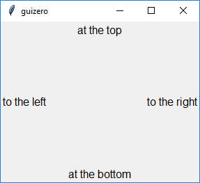
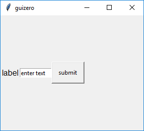
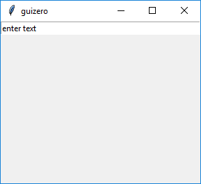
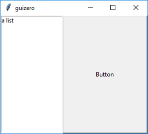
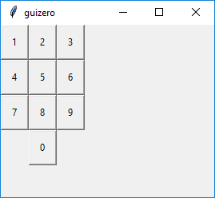
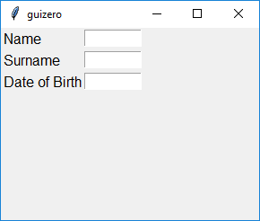
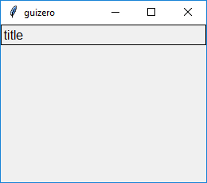
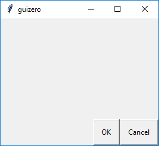

=======
Layouts
=======

Definire il layout di una applicazione grafica significa definire come gli oggetti grafici saranno posizionati all'interno
delle finestre dell'applicazione.

Le Widgets possono essere organizzate dentro **contenitori** (cioè gli oggetti `App`, `Window`, `Box`) utilizzando uno fra questi layout:

* ``auto``: in questo layout le widget sono posizionate automaticamente. E' il layout di default.
* ``grid``: in questo layout si divide il contenitore secondo una griglia immaginaria e si può specificare la posizione delle widget rispetto ad essa.

Vediamo come si specifica il layout da utilizzare per un contenitore.

.. code:: python
    
    app = App(layout="auto")
    # ... oppure ...
    app = App(layout="grid")
    # ... insomma... impostarlo non mi sembra impossibile :)

Layout \\"auto\\"
=================

`auto` è il layout di default che viene utilizzato quando si crea un contenitore. Se si vuole utilizzare questo, non c'è bisogno di specificare nulla, essendo questo il layout di default. In questo layout le widget sono poste in colonna in ordine di inserimento e posizionate al centro. Un esempio è meglio di 1000 parole se oltre a leggere il codice provate a *copiaincollarlo* ed eseguirlo.

.. code:: python

    from guizero import App, Text
    app = App()
    text_1 = Text(app, text="on top")
    text_2 = Text(app, text="below")
    app.display()

Il risultato sarà simile a questo:

.. image:: images/layout_auto.png
    

Allineamento
------------

Le widget possono essere allineate utilizzando i valori `top`, `bottom`, `left`, `right`, applicati alla proprietà `align`.

.. code:: python

    from guizero import App, Text
    app = App()
    top_text = Text(app, text="at the top", align="top")
    bottom_text = Text(app, text="at the bottom", align="bottom")
    left_text = Text(app, text="to the left", align="left")
    right_text = Text(app, text="to the right", align="right")
    app.display()

    
Allineando più di un oggetto nella stessa direzione essi saranno allineati uno dopo l'altro in ordine di creazione:

.. code:: python

    from guizero import App, Text, TextBox, PushButton
    app = App()
    text = Text(app, text="label", align="left")
    text_box = TextBox(app, text="enter text", align="left")
    button = PushButton(app, text="submit", align="left")
    app.display()

Filling
-------

Le widgets inserite in un layout auto possono anche essere impostate a *riempire* tutto lo spazio disponibile nelle due direzioni, utilizzando il valore `fill` con le 
proprietà `width` e `height`. Vediamo alcuni esempi, così approfittiamo per conoscere nuove widget:

Una `TextBox` che riempe tutta la larghezza di un contenitore:

.. code:: python

    from guizero import App, TextBox
    app = App()
    text_box = TextBox(app, text="enter text", width="fill")
    app.display()

    

Una `ListBox` che riempe tutto il lato sinistro usando `align=\\"left\\"` e `height=\\"fill\\"`:

.. code:: python

    from guizero import App, ListBox
    app = App()
    list_box = ListBox(app, items=["a list"], height="fill", align="left")
    app.display()

    
.. image:: images/layout_fill_height.png

Un pulsante che occupa TUTTO lo spazio disponibile usando `fill` sia per `width` che per `height`:

.. code:: python

    from guizero import App, PushButton
    app = App()
    button = PushButton(app, width="fill", height="fill")
    app.display()

.. image:: images/layout_fill_both.png

Quando più di un oggetto usa `fill`, il Window Manager (il software del Sistema Operativo che disegna e gestisce le finestre) distribuirà lo spazio tra tutte le widget che hanno richiesto di riempirlo:

.. code:: python
    
    from guizero import App, ListBox, PushButton
    app = App()
    list_box = ListBox(app, items=["a list", "of items", "yay"], height="fill", align="left")
    button = PushButton(app, width="fill", height="fill", align="right")
    app.display()

.. tip::
    Usare `fill` non sempre ha l'effetto che uno si aspetta quando si lavora con più widget: meglio in questo caso utilizzare il prossimo tipo di layout!

Layout \\"grid\\"
=================

Il `grid` layout permette di posizionare le widget in una `griglia virtuale`: essa viene divisa idealmente in una serie indefinita di celle numerate a partire
da [0,0] che sarebbe la cella in alto a sinistra.

Quando crei una widget, devi passare anche il parametro `grid` specificando le coordinate di posizionamento della stessa, nella forma `[x,y]`.

.. code:: python

    app = App(layout="grid")
    text = Text(app, text="Hello world", grid=[0,1])

Non hai bisogono di specificare altezza o larghezza della widget: sarà ridimensionata a seconda dello spazio disponibile nella finestra, considerando anche tutte le altre
widget. Questa caratteristica può tornare molto utile quando si creano finestre stile "tastierino numerico" o stile "form da compilare". Vediamo qualche esempio relativo a queste idee.

Il **tastierino numerico**:

.. code:: python

    from guizero import App, PushButton

    app = App(layout="grid")

    button1 = PushButton(app, text="1", grid=[0,0])
    button2 = PushButton(app, text="2", grid=[1,0])
    button3 = PushButton(app, text="3", grid=[2,0])
    button4 = PushButton(app, text="4", grid=[0,1])
    button5 = PushButton(app, text="5", grid=[1,1])
    button6 = PushButton(app, text="6", grid=[2,1])
    button7 = PushButton(app, text="7", grid=[0,2])
    button8 = PushButton(app, text="8", grid=[1,2])
    button9 = PushButton(app, text="9", grid=[2,2])
    button0 = PushButton(app, text="0", grid=[1,3])

    app.display()
    
E questo è il risultato!

    
Il **form da compilare**:

.. code:: python

    from guizero import App, Text, TextBox

    app = App(layout="grid")

    name_label = Text(app, text="Name", grid=[0,0], align="left")
    name = TextBox(app, grid=[1,0])
    surname_label = Text(app, text="Surname", grid=[0,1], align="left")
    surname = TextBox(app, grid=[1,1])
    dob_label = Text(app, text="Date of Birth", grid=[0,2], align="left")
    dob = TextBox(app, grid=[1,2])

    app.display()

    

Spanning (per righe o colonne)
------------------------------

Le widget possono essere impostate per occupare più celle contigue di una griglia, specificando il numero di celle in entrambe le direzioni in cui queste devono
espandersi. In questo caso la lista da passare al parametro `grid` diventa `[x,y,xspan,yspan]`.

Come al solito, vediamo un esempio per capire meglio il concetto:

.. code:: python
    
    from guizero import App, Picture

    app = App(layout="grid")

    picture1 = Picture(app, image="std1.gif", grid=[0,0])
    picture2 = Picture(app, image="std2.gif", grid=[1,0])
    picture3 = Picture(app, image="tall1.gif", grid=[2,0,1,2])
    picture4 = Picture(app, image="wide1.gif", grid=[0,1,2,1])

    app.display()

.. image:: images/layout_grid_span.png

Box Widgets
===========

Una `Box` widget è un contenitore utilizzato esclusivamente per creare layout più organizzati e complessi, senza strutture difficili: si creano vari box contenenti ognuno un layout semplice e si combinano fino a raggiungere la struttura desiderata.

.. image:: images/layout_boxes.png

Inoltre puoi utilizzare i `Box` per combinare le proprietà dei due layout. Nel prossimo esempio il Box è inserito in modalità `fill` mentre ha al suo interno
una `Text` allineata a sinistra.

.. code:: python

    from guizero import App, Box, Text
    app = App()

    title_box = Box(app, width="fill", align="top")
    title = Text(title_box, text="title", align="left")

    app.display()

.. image:: images/layout_boxes_title.png

I `Box` possono essere impostati per evidenziare anche i loro bordi, per evidenziare ancora di più il layout che impongono, utilizzando il parametro `border` 
impostato a `True`.

.. code:: python
    
    title_box = Box(app, width="fill", align="top", border=True)

Analogamente possiamo scrivere un codice simile per mettere i pulsanti *OK* e *CANCELLA* in basso a destra. 

.. tip::
    Ricorda che le widget vengono inserite in ordine di creazione, 
    quindi per l'allineamento a destra il pulsante cancella deve essere creato **prima** del pulsante ok.

.. code:: python

    from guizero import App, Box, PushButton
    app = App()

    buttons_box = Box(app, width="fill", align="bottom")
    cancel = PushButton(buttons_box, text="Cancel", align="right")
    ok = PushButton(buttons_box, text="OK", align="right")

    app.display()

    
.. note::
    Quando progetti una GUI potrebbe essere più semplice provare **prima** a disegnarla a matita, per ragionare su widget e layout.

    .. image:: images/layout_scheme.jpg

Esercizi
========

blah blah
