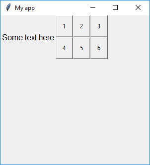

===
Box
===

L'oggetto `Box` è un contenitore invisibile utilizzato per raggruppare le widget nella GUI e costruire layout più articolati.

Contiene un oggetto `tkinter.Frame`.

.. code:: python

    __init__(
        self,
        master,
        layout="auto",
        grid=None,
        align=None,
        visible=True,
        enabled=None,
        width=None,
        height=None,
        border=None)

Per utilizzare un oggetto `Box` basta scrivere un codice tipo questo:

.. code:: python

    from guizero import App, Box
    app = App()
    box = Box(app)
    app.display()
    

Parametri iniziali
==================

Quando si crea un oggetto `Box`, **si deve specificare un master** e poi eventualmente altri parametri opzionali. I parametri sono:

========= ================ ========= ============ ========================================================================================
Parametro Tipo             Default   Obbligatorio Descrizione
--------- ---------------- --------- ------------ ----------------------------------------------------------------------------------------
master    App, Window, Box           Yes          Il contenitore a cui il Box appartiene
align     string           None      No           Allineamento della widget nel suo contenitore: `"top"`, `"bottom"`, `"left"`, `"right"`.
grid      List             None      No           Coordinate `[x,y]` della widget. Solo con layout grid.
layout    string           "auto"    No           Tipo di layout: "auto" oppure "grid".
visible   boolean          True      No           Visibilità della widget
enabled   boolean          None      No           Se la widget è abilitata oppure no.
width     size             None      No           Larghezza della widget in pixel, oppure `"fill"`
height    size             None      No           Altezza della widget in pixel, oppure `"fill"`
border    int              None      No           Larghezza del bordo in pixels.
========= ================ ========= ============ ========================================================================================

Metodi
======

Elenco alfabetico dei metodi disponibili nell'oggetto `Box`:

add_tk_widget(tk_widget, grid=None, align=None, visible=True, enabled=None, width=None, height=None) 
    *tk_widget (tk), grid (list), align (str), visible (bool), enabled (bool), width (int), height (int)*
    
    Aggiunge una widget tk in un Box GuiZero. PS: Funzionalità avanzata. Verrà utilizzata solo se necessario.

    
after(time, command, args=None)
    *time (int), command (function name), args (list of arguments)*
    
    Programma una chiamata **singola** alla funzione indicata nel parametro `command` dopo `time` millisecondi.
    

cancel(command)
    *command (function name)*
    
    Cancella una chiamata programmata a `command`.
    

destroy()
    Distrugge la widget.
    

disable()
    Disabilita la Box e tutte le widget al suo interno.

    
enable()
    Abilita la window e tutte le widget al suo interno.

focus()
    Da il focus alla Box e quindi agli oggetti in essa contenuti.
    

hide()
    Nasconde la widget.

repeat(time, command, args=None)
    *time (int), command (function name), args (list of arguments)*
    
    Programma una chiamata **ripetuta** alla funzione indicata nel parametro `command` dopo ogni `time` millisecondi.

    
resize(width, height)
    *width (int), height (int)*
    
    Imposta larghezza e altezza del Box.
    
    
set_border(thickness, color)
    *thickness (int), color (color)*
    
    Imposta lo spessore e il colore del bordo.
    
    
show()
    Visualizza il Box se prima era stata nascosto con `hide()`.

Attributi
=========

Elenco degli attributi accessibili per l'oggetto `Box`:

=========== ================ ========================================================================================
Parametro   Tipo             Descrizione
----------- ---------------- ----------------------------------------------------------------------------------------
align       string           Allineamento della widget nel suo contenitore: `"top"`, `"bottom"`, `"left"`, `"right"`.
bg          color            Il colore di sfondo del Box
border      int              Larghezza del bordo in pixels.
children    list             La lista delle widget contenute
enabled     boolean          Se la widget è abilitata oppure no.
font        string           Nome del font da utilizzare nella widget
grid        List             Coordinate `[x,y]` della widget. Solo con layout grid.
height      size             Altezza della widget in pixel, oppure `"fill"`.
layout      string           Tipo di layout: `"auto"` oppure `"grid"`.
master      App, Window, Box Il contenitore a cui il Box appartiene
text_size   int              Dimensione del font da utilizzare nella widget
text_color  color            Colore del font da utilizzare nella widget
visible     boolean          Visibilità della widget
width       size             Larghezza della widget in pixel, oppure `"fill"`
=========== ================ ========================================================================================

Esempi
======

**Putting widgets in a Box**

.. code:: python

    from guizero import App, Box, Text
    app = App(title="My app", height=300, width=400)
    box = Box(app)
    text1 = Text(box, text="Hello from the box", size=14, text_color="red", font="Arial")
    text2 = Text(app, text="Hello from the app", size=14, text_color="blue", font="Courier New")
    app.display()

.. image:: images/box-app.png

**Grouping objects within a Box**

.. code:: python

    from guizero import App, Text, Box, PushButton
    def do_nothing():
        return 0

    app = App(title="My app", height=300, width=300, layout="grid")
    text = Text(app, text="Some text here", grid=[0,0])
    box = Box(app, layout="grid", grid=[1,0])
    button1 = PushButton(box, command=do_nothing, text="1", grid=[0,0])
    button2 = PushButton(box, command=do_nothing, text="2", grid=[1,0])
    button3 = PushButton(box, command=do_nothing, text="3", grid=[2,0])
    button4 = PushButton(box, command=do_nothing, text="4", grid=[0,1])
    button5 = PushButton(box, command=do_nothing, text="5", grid=[1,1])
    button6 = PushButton(box, command=do_nothing, text="6", grid=[2,1])
    app.display()

