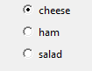

===========
ButtonGroup
===========

L'oggetto `ButtonGroup` visualizza un gruppo di radio button, permettendo all'utente una selezione mutualmente esclusiva fra questi.

Contiene un oggetto `tkinter.Frame`.

.. code:: python

    __init__(
        self,
        master,
        options=[],
        selected=None,
        horizontal=False,
        command=None,
        grid=None,
        align=None,
        args=None,
        visible=True,
        enabled=None,
        width=None,
        height=None)

Per utilizzare un oggetto `ButtonGroup` basta scrivere un codice tipo questo:

.. code:: python

    from guizero import App, ButtonGroup
    app = App()
    choice = ButtonGroup(app, options=["cheese", "ham", "salad"], selected="cheese")
    app.display()

Parametri iniziali
==================

Quando si crea un oggetto `ButtonGroup`, **si deve specificare un master** e poi eventualmente altri parametri opzionali. I parametri sono:

========== ================ ========= ============ ========================================================================================
Parametro  Tipo             Default   Obbligatorio Descrizione
---------- ---------------- --------- ------------ ----------------------------------------------------------------------------------------
master     App, Window, Box           Yes          Il contenitore a cui la widget appartiene
options    List, 2D List              No           Lista degli elementi. In caso di lista 2D gli elementi saranno una coppia [text, value]
selected   string                     No           Il valore inizialmente selezionato
align      string           None      No           Allineamento della widget nel suo contenitore: `"top"`, `"bottom"`, `"left"`, `"right"`.
command    function         None      No           La funzione da eseguire quando un'opzione viene selezionata
args       List             None      No           Gli (eventuali) argomenti da passare alla funzione del parametro command
grid       List             None      No           Coordinate `[x,y]` della widget. Solo con layout grid.
horizontal boolean          False     No           Se le opzioni sono ordinati verticalmente (default) o orizzontalmente
visible    boolean          True      No           Visibilità della widget
enabled    boolean          None      No           Se la widget è abilitata oppure no.
width      size             None      No           Larghezza della widget in pixel, oppure `"fill"`
height     size             None      No           Altezza della widget in pixel, oppure `"fill"`
========== ================ ========= ============ ========================================================================================

Metodi
======

Elenco alfabetico dei metodi disponibili nell'oggetto `ButtonGroup`:

append(option)                      
    *item (string)*
    
    Aggiunge una nuova opzione in fondo alla lista

after(time, command, args=None)
    *time (int), command (function name), args (list of arguments)*
    
    Programma una chiamata **singola** alla funzione indicata nel parametro `command` dopo `time` millisecondi.
    

cancel(command)
    *command (function name)*
    
    Cancella una chiamata programmata a `command`.
    

destroy()
    Distrugge la widget.
    

disable()
    Disabilita la Box e tutte le widget al suo interno.

    
enable()
    Abilita la window e tutte le widget al suo interno.

focus()
    Da il focus alla Box e quindi agli oggetti in essa contenuti.
    

get_group_as_list()
    Ritorna una lista contenente tutte le opzioni, eventualmente anche con le coppie 2D.

    
hide()
    Nasconde la widget.

insert(index, option)
    *index (int), option (string)*
    
    Aggiunge una nuova opzione all'indice indicato.
    

remove(option)
    *item (string)*
    
    Rimuove la prima opzione che si chiama `option`. Ritorna `True` se qualcosa viene eliminato, `False` altrimenti.
    

repeat(time, command, args=None)
    *time (int), command (function name), args (list of arguments)*
    
    Programma una chiamata **ripetuta** alla funzione indicata nel parametro `command` dopo ogni `time` millisecondi.

resize(width, height)
    *width (int), height (int)*
    
    Imposta larghezza e altezza del Box.
    
    
show()
    Visualizza il Box se prima era stata nascosto con `hide()`.

update_command(command, args=None) 
    *command (function), args (list)*
    
    Aggiorna la funzione da chiamare quando si seleziona un'opzione.
    

Attributi
=========

Elenco degli attributi accessibili per l'oggetto `ButtonGroup`:

=========== ================ ========================================================================================
Parametro   Tipo             Descrizione
----------- ---------------- ----------------------------------------------------------------------------------------
align       string           Allineamento della widget nel suo contenitore: `"top"`, `"bottom"`, `"left"`, `"right"`.
bg          color            Il colore di sfondo della widget
enabled     boolean          Se la widget è abilitata oppure no.
font        string           Nome del font da utilizzare nella widget
grid        List             Coordinate `[x,y]` della widget. Solo con layout grid.
height      size             Altezza della widget in pixel, oppure `"fill"`.
master      App, Window, Box Il contenitore a cui la widget appartiene
text_size   int              Dimensione del font da utilizzare nella widget
text_color  color            Colore del font da utilizzare nella widget
value       string           Il valore (eventualmente) nascosto abbinato all'opzione selezionata
value_text  string           Il testo associato con l'opzione selezionata.
visible     boolean          Visibilità della widget
width       size             Larghezza della widget in pixel, oppure `"fill"`
=========== ================ ========================================================================================

Esempi
======

**Creating a ButtonGroup with a 2D list**

.. code:: python

    from guizero import App, ButtonGroup, Text

    def update_text():
        what_is_selected.value = activities.value

    app = App()
    activities = ButtonGroup(app, options=[
                                ["Roller Skating", "skate"],
                                ["White water rafting", "WWR"],
                                ["Mountain climbing", "climb"]
                                ],
                                selected="skate", command=update_text)

    what_is_selected = Text(app, text="skate")
    app.display()

