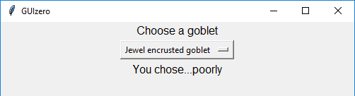

=====
Combo
=====

L'oggetto `Combo` visualizza un menù a discesa da cui è possibile selezionare una opzione.

.. image:: images/combo_windows.png

Contiene un oggetto `tkinter.OptionMenu`:

.. code:: python

    __init__(
        self,
        master,
        options=[],
        selected=None,
        command=None,
        grid=None,
        align=None,
        visible=True,
        enabled=None,
        width=None,
        height=None)

Per utilizzare un oggetto `Combo` basta scrivere un codice tipo questo:

.. code:: python

    from guizero import App, Combo
    app = App()
    combo = Combo(app, options=["Beef", "Chicken", "Fish", "Vegetarian"])
    app.display()

Parametri iniziali
==================

Quando si crea un oggetto `Combo`, **si deve specificare un master** e poi eventualmente altri parametri opzionali. I parametri sono:

========== ================ ========= ============ ===============================================================================================================
Parametro  Tipo             Default   Obbligatorio Descrizione
========== ================ ========= ============ ===============================================================================================================
master     App, Window, Box           Yes          Il contenitore a cui la widget appartiene
options    list             None      No           La lista dei valori da visualizzare
selected   string           None      No           Il valore selezionato inizialmente
align      string           None      No           Allineamento della widget nel suo contenitore: `"top"`, `"bottom"`, `"left"`, `"right"`.
command    function         None      No           La funzione da eseguire quando un'opzione viene selezionata. Può prendere come parametro il valore della combo
grid       List             None      No           Coordinate `[x,y]` della widget. Solo con layout grid.
visible    boolean          True      No           Visibilità della widget
enabled    boolean          None      No           Se la widget è abilitata oppure no.
width      size             None      No           Larghezza della widget in pixel, oppure `"fill"`
height     size             None      No           Altezza della widget in pixel, oppure `"fill"`
========== ================ ========= ============ ===============================================================================================================

Metodi
======

Elenco alfabetico dei metodi disponibili nell'oggetto `Combo`:

after(time, command, args=None)
    *time (int), command (function name), args (list of arguments)*
    
    Programma una chiamata **singola** alla funzione indicata nel parametro `command` dopo `time` millisecondi.
    

append(option)
    *item (string)*
    
    Aggiunge una nuova opzione alla `Combo`.
    

cancel(command)
    *command (function name)*
    
    Cancella una chiamata programmata a `command`.
    

clear()
    Rimuove tutte le opzioni dalla `Combo`.
    

destroy()
    Distrugge la widget.
    

disable()
    Disabilita la Box e tutte le widget al suo interno.

    
enable()
    Abilita la window e tutte le widget al suo interno.

focus()
    Da il focus alla Box e quindi agli oggetti in essa contenuti.

    
hide()
    Nasconde la widget.

insert(index, option)
    *index (int), item (string)*
    
    Inserisce l'opzione `option` al posto `index` della `Combo`
    

remove(option)
    *item (string)*
    
    Rimuove la prima opzione chiamata `option` della `Combo`. Ritorna `True` se rimuove qualcosa, `False` altrimenti.
    

repeat(time, command, args=None)
    *time (int), command (function name), args (list of arguments)*
    
    Programma una chiamata **ripetuta** alla funzione indicata nel parametro `command` dopo ogni `time` millisecondi.

resize(width, height)
    *width (int), height (int)*
    
    Imposta larghezza e altezza del Box.

select_default()
    Resetta la `Combo` a selezionare il valore iniziale.

    
show()
    Visualizza il Box se prima era stata nascosto con `hide()`.
    

update_command(command, args=None) 
    *command (function), args (list)*
    
    Aggiorna la funzione da chiamare quando si seleziona un'opzione.

Attributi
=========

Elenco degli attributi accessibili per l'oggetto `CheckBox`:

=========== ================ ========================================================================================
Parametro   Tipo             Descrizione
=========== ================ ========================================================================================
align       string           Allineamento della widget nel suo contenitore: `"top"`, `"bottom"`, `"left"`, `"right"`.
bg          color            Il colore di sfondo della widget
enabled     boolean          Se la widget è abilitata oppure no.
font        string           Nome del font da utilizzare nella widget
grid        List             Coordinate `[x,y]` della widget. Solo con layout grid.
height      size             Altezza della widget in pixel, oppure `"fill"`.
master      App, Window, Box Il contenitore a cui la widget appartiene
text_size   int              Dimensione del font da utilizzare nella widget
text_color  color            Colore del font da utilizzare nella widget
value       string           Il testo associato all'opzione selezionata.
visible     boolean          Visibilità della widget
width       size             Larghezza della widget in pixel, oppure `"fill"`
=========== ================ ========================================================================================

Esempi
======

**Calling a function when the value selected changes**

.. code:: python

    from guizero import App, Text, Combo
    def you_chose(selected_value):
        if selected_value == "Tiny goblet":
            result.value = "You chose...wisely"
        else:
            result.value = "You chose...poorly"

    app = App()
    instructions = Text(app, text="Choose a goblet")
    combo = Combo(app, options=["", "Huge golden goblet", "Jewel encrusted goblet", "Tiny goblet"], command=you_chose)
    result = Text(app)
    app.display()

