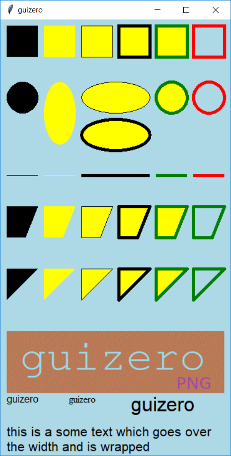
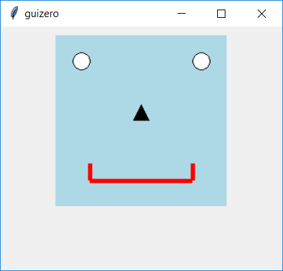

=======
Drawing
=======

L'oggetto `Drawing` permette di creare e disegnare forme, immagini e testo.

Contiene un oggetto `tkinter.canvas`

.. code:: python

    __init__(
        self, 
        master, 
        width=100, 
        height=100, 
        grid=None, 
        align=None, 
        visible=True, 
        enabled=None)

Proviamo a creare un oggetto `Drawing` e a disegnarci dentro un rettangolo blu 50x50:

.. code:: python

    from guizero import App, Drawing
    app = App()
    drawing = Drawing(app)
    drawing.rectangle(10, 10, 60, 60, color="blue")
    app.display()

Parametri iniziali
==================

Quando si crea un oggetto `Drawing`, **si deve specificare un master** e poi eventualmente altri parametri opzionali. I parametri sono:

========== ================ ========= ============ ===============================================================================================================
Parametro  Tipo             Default   Obbligatorio Descrizione
---------- ---------------- --------- ------------ ---------------------------------------------------------------------------------------------------------------
master     App, Window, Box           Yes          Il contenitore a cui la widget appartiene
align      string           None      No           Allineamento della widget nel suo contenitore: `"top"`, `"bottom"`, `"left"`, `"right"`.
enabled    boolean          None      No           Se la widget è abilitata oppure no.
grid       List             None      No           Coordinate `[x,y]` della widget. Solo con layout grid.
height     size             None      No           Altezza della widget in pixel, oppure `"fill"`
visible    boolean          True      No           Visibilità della widget
width      size             None      No           Larghezza della widget in pixel, oppure `"fill"`
========== ================ ========= ============ ===============================================================================================================

Metodi
======

Elenco alfabetico dei metodi disponibili nell'oggetto `Drawing`:

after(time, command, args=None)
    *time (int), command (function name), args (list of arguments)*
    
    Programma una chiamata **singola** alla funzione indicata nel parametro `command` dopo `time` millisecondi.
    

cancel(command)
    *command (function name)*
    
    Cancella una chiamata programmata a `command`.
    

clear()
    Rimuove tutte i disegni dall'oggetto `Drawing`.
    

delete(id)
    *id (int)*
    
    Cancella il disegno con id `id` dall'oggetto `Drawing`.
    
    
destroy()
    Distrugge la widget.
    

disable()
    Disabilita la Box e tutte le widget al suo interno.

    
enable()
    Abilita la window e tutte le widget al suo interno.

focus()
    Da il focus alla Box e quindi agli oggetti in essa contenuti.

    
hide()
    Nasconde la widget.
    

repeat(time, command, args=None)
    *time (int), command (function name), args (list of arguments)*
    
    Programma una chiamata **ripetuta** alla funzione indicata nel parametro `command` dopo ogni `time` millisecondi.

resize(width, height)
    *width (int), height (int)*
    
    Imposta larghezza e altezza del Box.

    
show()
    Visualizza il Box se prima era stata nascosto con `hide()`.
    

update_command(command, args=None) 
    *command (function), args (list)*
    
    Aggiorna la funzione da chiamare quando si seleziona un'opzione.

image(self, x, y, image, width=None, height=None)
    *x (int), y (int), image (str), width (int), height (int)*
    
    Inserisce una immagine nel Drawing alla posizione indicata e ritorna il suo Id.
    

line(x1, y1, x2, y2, color="black", width=1)
    *x1 (int), y1 (int), x2 (int), y2 (int), color (str), width (int)*
    
    Disegna una linea tra i 2 punti indicati e ritorna il suo Id
    

oval(x1, y1, x2, y2, color="black", outline=False, outline_color="black")
    *x1 (int), y1 (int), x2 (int), y2 (int), color (str), outline (int), outline_color (str)*
    
    Disegna un ovale tra i 2 punti indicati e ritorna il suo Id

polygon(*coords, color="black", outline=False, outline_color="black")
    *coords (list int), color (str), outline (int), outline_color (str)*
    
    Disegna un poligono tra tutte le coordinate passate come argomenti e ritorna il suo Id.
    
    
rectangle(x1, y1, x2, y2, color="black", outline=False, outline_color="black")
    *x1 (int), y1 (int), x2 (int), y2 (int), color (str), outline (int), outline_color (str)*
    
    Disegna un rettangolo tra i 2 punti indicati e ritorna il suo Id.
    
    
text(x, y, text, color="black", font=None, size=None, max_width=None)
    *x (int), y (int), text (str), color (str), font (str), size (str), max_width (int)*
    
    Inserisce un testo alla posizione indicata e ritorna il suo Id.
    

triangle(x1, y1, x2, y2, x3, y3, color="black", outline=False, outline_color="black")
    *x1 (int), y1 (int), x2 (int), y2 (int), x3 (int), y3 (int), color (str), outline (int), outline_color (str)*
    
    Disegna un triangolo tra i 3 punti indicati e ritorna il suo Id.
    

Attributi
=========

Elenco degli attributi accessibili per l'oggetto `Drawing`:

=========== ================ ========================================================================================
Parametro   Tipo             Descrizione
----------- ---------------- ----------------------------------------------------------------------------------------
align       string           Allineamento della widget nel suo contenitore: `"top"`, `"bottom"`, `"left"`, `"right"`.
bg          color            Il colore di sfondo della widget
enabled     boolean          Se la widget è abilitata oppure no.
grid        List             Coordinate `[x,y]` della widget. Solo con layout grid.
height      size             Altezza della widget in pixel, oppure `"fill"`.
master      App, Window, Box Il contenitore a cui la widget appartiene
visible     boolean          Visibilità della widget
width       size             Larghezza della widget in pixel, oppure `"fill"`
=========== ================ ========================================================================================

Esempi
======

**Draw a robot face**

.. code:: python

    from guizero import App, Drawing

    a = App()

    # create drawing object
    d = Drawing(a, width=220, height=220)
    d.rectangle(10, 10, 210, 210, color="light blue")
    d.oval(30, 30, 50, 50, color="white", outline=True)
    d.oval(170, 30, 190, 50, color="white", outline=True)
    d.triangle(110, 90, 120, 110, 100, 110, color="black")
    d.line(50, 180, 50, 160, color="red", width=5)
    d.line(50, 180, 170, 180, color="red", width=5)
    d.line(170, 180, 170, 160, color="red", width=5)

    a.display()

