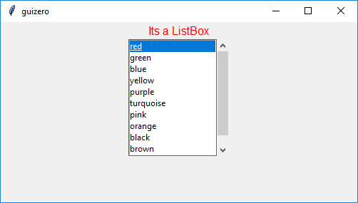

=======
ListBox
=======

L'oggetto `ListBox` visualizza una lista di items di cui uno o molti possono essere selezionati.

.. image:: images/listbox_windows.png

Contiene un oggetto `tkinter.ListBox`

.. code:: python

    __init__(
        self,
        master,
        items=None,
        selected=None,
        command=None,
        grid=None,
        align=None,
        visible=True,
        enabled=None,
        multiselect=False,
        scrollbar=False,
        width=None,
        height=None)

        
Per utilizzare un oggetto `ListBox` basta scrivere un codice tipo questo:

.. code:: python

    from guizero import App, ListBox
    app = App()
    listbox = ListBox(app, items=["Beef", "Chicken", "Fish", "Vegetarian"])
    app.display()

Parametri iniziali
==================

Quando si crea un oggetto `ListBox`, **si deve specificare un master** e poi eventualmente altri parametri opzionali. I parametri sono:

=========== ================ ========= ============ ========================================================================================
Parametro   Tipo             Default   Obbligatorio Descrizione
=========== ================ ========= ============ ========================================================================================
master      App, Window, Box           Yes          Il contenitore a cui la widget appartiene
selected    string or list   None      No           L'elemento (o gli elementi) selezionati
items       list                                    La lista degli elementi da visualizzare
multiselect boolean          False     No           Se True, abilita la possibilità di selezionare più voci contemporaneamente.
scrollbar   boolean          False     No           Se True, abilita la scrollbar verticale.
align       string           None      No           Allineamento della widget nel suo contenitore: \\"top\\", \\"bottom\\", \\"left\\", \\"right\\".
command     function         None      No           La funzione da eseguire quando un'opzione viene selezionata
grid        List             None      No           Coordinate **[x,y]** della widget. Solo con layout grid.
visible     boolean          True      No           Visibilità della widget
enabled     boolean          None      No           Se la widget è abilitata oppure no.
width       size             None      No           Larghezza della widget **in pixel**, oppure \\"fill\\"
height      size             None      No           Altezza della widget **in pixel**, oppure \\"fill\\"
=========== ================ ========= ============ ========================================================================================

Metodi
======

Elenco alfabetico dei metodi disponibili nell'oggetto `ListBox`:

after(time, command, args=None)
    *time (int), command (function name), args (list of arguments)*
    
    Programma una chiamata **singola** alla funzione indicata nel parametro `command` dopo `time` millisecondi.
    

append(item)
    *item (string)*
    
    Aggiunge un nuovo elemento in fondo alla ListBox.
    
    
cancel(command)
    *command (function name)*
    
    Cancella una chiamata programmata a `command`.
    

clear()
    Svuota la ListBox, cancellando tutti gli elementi al suo interno
    
    
destroy()
    Distrugge la widget.
    

disable()
    Disabilita la Box e tutte le widget al suo interno.

    
enable()
    Abilita la window e tutte le widget al suo interno.

focus()
    Da il focus alla Box e quindi agli oggetti in essa contenuti.

    
hide()
    Nasconde la widget.

insert(index, item)
    *index (int), item (string)*
    
    Aggiunge un nuovo elemento nella ListBox alla posizione indicata
    

remove(item)
    *item (string)*
    
    Rimuove il primo elemento che si chiama `item` dalla ListBox. Ritorna `True` se rimuove un elemento, `False` altrimenti.
    
    
repeat(time, command, args=None)
    *time (int), command (function name), args (list of arguments)*
    
    Programma una chiamata **ripetuta** alla funzione indicata nel parametro `command` dopo ogni `time` millisecondi.

resize(width, height)
    *width (int), height (int)*
    
    Imposta larghezza e altezza del Box.
    
    
show()
    Visualizza il Box se prima era stata nascosto con `hide()`.

update_command(command, args=None) 
    *command (function), args (list)*
    
    Aggiorna la funzione da chiamare quando si seleziona un'opzione.

    

Attributi
=========

Elenco degli attributi accessibili per l'oggetto `ListBox`:

=========== ================ ========================================================================================
Parametro   Tipo             Descrizione
=========== ================ ========================================================================================
align       string           Allineamento della widget nel suo contenitore: \\"top\\", \\"bottom\\", \\"left\\", \\"right\\".
bg          color            Il colore di sfondo della widget
enabled     boolean          Se la widget è abilitata oppure no.
font        string           Nome del font da utilizzare nella widget
grid        List             Coordinate **[x,y]** della widget. Solo con layout grid.
height      size             Altezza della widget **in pixel**, oppure \\"fill\\".
items       List             Lista degli elementi visualizzati nella `ListBox`
master      App, Window, Box Il contenitore a cui la widget appartiene
text_size   int              Dimensione del font da utilizzare nella widget
text_color  color            Colore del font da utilizzare nella widget
value       string           Imposta o ritorna il valore (o i valori) selezionati nella `ListBox`
visible     boolean          Visibilità della widget
width       size             Larghezza della widget **in pixel**, oppure \\"fill\\"
=========== ================ ========================================================================================

Esempi
======

**Select a text color from a ListBox**

.. code:: python

    from guizero import App, ListBox, Text

    def change_color(value):
        t.text_color = value

    a = App()

    t = Text(a, text="Its a ListBox", color="black")

    listbox = ListBox(
        a, 
        items=["red", "green", "blue", "yellow", "purple", "turquoise", "pink", "orange", "black", "brown", "cyan"], 
        selected="black", 
        command=change_color,
        scrollbar=True)

    a.display()

