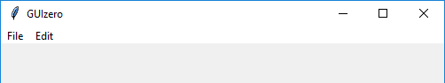

=======
MenuBar
=======

L'oggetto `MenuBar` visualizza un menù in alto della widget, con ogni voce del menù che attiva un sottomenù.

.. image:: images/menubar_windows.png

Contiene un oggetto `tkinter.Menu`.

.. code:: python

    __init__(
        self, 
        master, 
        toplevel, 
        options)

        
E' possibile creare un oggetto `MenuBar` con un codice tipo questo:

.. code:: python

    from guizero import App, MenuBar
    def file_function():
        print("File option")

    def edit_function():
        print("Edit option")

    app = App()
    menubar = MenuBar(app,
                    toplevel=["File", "Edit"],
                    options=[
                        [ ["File option 1", file_function], ["File option 2", file_function] ],
                        [ ["Edit option 1", edit_function], ["Edit option 2", edit_function] ]
                    ])
    app.display()

Parametri iniziali
==================

Quando si crea un oggetto `MenuBar`, **si devono specificare tutti i parametri**.

=========== ================ ========= ============ =================================================================================
Parametro   Tipo             Default   Obbligatorio Descrizione
=========== ================ ========= ============ =================================================================================
master      App, Window, Box           Yes          Il contenitore a cui la widget appartiene
toplevel    List                       Yes          La lista delle voci di menù
options     List 3D                    Yes          Una lista di sottomenù, tipicamente un elemento per ognuna delle voci precedenti.
=========== ================ ========= ============ =================================================================================

Il parametro `master` ci è ormai familiare e non ci preoccupa minimamente.

Il parametro `toplevel` è abbastanza semplice: è una lista dei nomi dei menù che popoleranno la MenuBar. Se riguardate l'immagine precedente, la lista
che l'ha creata sarebbe solo quella con le due voci di menù elencate:

.. code:: python

    toplevel = ["File", "Edit"]
    
Nell'esempio dell'immagine seguente abbiamo solo le voci `File` ed `Edit`.

Il parametro `options` è una lista 3D contenente una lista di sottovoci che sono esse stesse liste. Essendo una lista a 3 ivelli, andiamo a spiegarla a partire dal primo
livello:

#. Osservando il parametro toplevel ci accorgiamo che presenta 2 voci di menù: allora la lista `options` sarà una lista con 2 elementi.

#. Ognuno di questi elementi sarà a sua volta una lista e conterrà le voci del menù a cui appartengono.

#. Ogni voce di menù si specifica con una lista di 2 elementi: nel primo c'è il nome della voce di menù, nel secondo c'è la funzione da chiamare quando esso viene attivato.

Nell'esempio di codice seguente vengono create le voci per i menù File (apri, esci) ed Edit (taglia, copia, incolla) con le voci di menù (stringhe) in Italiano
e i nomi delle funzioni in Inglese:

.. code:: python
    
    options = [ 
                [ ["apri", open], ["esci", exit] ],
                [ ["taglia", cut], ["copia", copy], ["incolla", paste] ]
            ]
            

.. warning:: 

    Una MenuBar non viene mai visualizzata all'interno di un layout di tipo grid: ecco perché non ci sono in essa
    parametri per il layout o l'allineamento.
    

Metodi
======

Elenco alfabetico dei metodi disponibili nell'oggetto `MenuBar`:

after(time, command, args=None)
    *time (int), command (function name), args (list of arguments)*
    
    Programma una chiamata **singola** alla funzione indicata nel parametro `command` dopo `time` millisecondi.
    

cancel(command)
    *command (function name)*
    
    Cancella una chiamata programmata a `command`.
    
    
destroy()
    Distrugge la widget.
    

focus()
    Da il focus alla Box e quindi agli oggetti in essa contenuti.

    
repeat(time, command, args=None)
    *time (int), command (function name), args (list of arguments)*
    
    Programma una chiamata **ripetuta** alla funzione indicata nel parametro `command` dopo ogni `time` millisecondi.

    
Attributi
=========

Elenco degli attributi accessibili per l'oggetto `MenuBar`:

=========== ================ ==========================================
Parametro   Tipo             Descrizione
=========== ================ ==========================================
master      App, Window, Box Il contenitore a cui la widget appartiene
=========== ================ ==========================================

