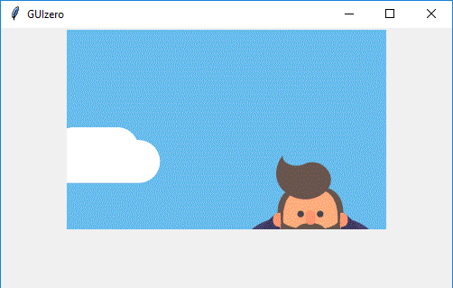

=======
Picture
=======

L'oggetto `Picture` visualizza una immagine. Facile :)

Contiene un oggetto `tkinter.Label`.

.. code:: python

    __init__(
        self, 
        master, 
        image=None, 
        grid=None, 
        align=None, 
        visible=True, 
        enabled=None, 
        width=None, 
        height=None)

E' possibile creare un oggetto `Picture` con un codice tipo questo:

.. code:: python

    from guizero import App, Picture
    app = App()
    picture = Picture(app, image="test.gif")
    app.display()

Per funzionare devi specificare correttamente il percorso dell'immagine. Nell'esempio precedente l'immagine si trova nella stessa cartella del file Python.
Se devi specificare l'immagine in un'altra cartella, devi ricorrere ad un *percorso relativo*: se ad esempio l'immagine `test.gif` si trovasse nella sottocartella `images`,
allora il percorso relativo sarebbe `images/test.gif`.

Per quanto riguarda i **tipi di immagine supportati** ricorda il discorso fatto sulle immagini qui: `108_images.html`.

Parametri iniziali
==================

Quando si crea un oggetto `Picture`, **si deve specificare un master** e poi eventualmente altri parametri opzionali. I parametri sono:

=========== ================ ========= ============ ========================================================================================
Parametro   Tipo             Default   Obbligatorio Descrizione
----------- ---------------- --------- ------------ ----------------------------------------------------------------------------------------
master      App, Window, Box           Yes          Il contenitore a cui la widget appartiene
image       string           None      -            Il percorso relativo dell'immagine da visualizzare
align       string           None      -            Allineamento della widget nel suo contenitore: `"top"`, `"bottom"`, `"left"`, `"right"`.
grid        List             None      -            Coordinate `[x,y]` della widget. Solo con layout grid.
visible     boolean          True      No           Visibilità della widget
enabled     boolean          None      No           Se la widget è abilitata oppure no.
width       size             None      No           Larghezza della widget in pixel, oppure `"fill"`
height      size             None      No           Altezza della widget in pixel, oppure `"fill"`
=========== ================ ========= ============ ========================================================================================

Metodi
======

Elenco alfabetico dei metodi disponibili nell'oggetto `Picture`:

after(time, command, args=None)
    *time (int), command (function name), args (list of arguments)*
    
    Programma una chiamata **singola** alla funzione indicata nel parametro `command` dopo `time` millisecondi.
    

cancel(command)
    *command (function name)*
    
    Cancella una chiamata programmata a `command`.
    
    
destroy()
    Distrugge la widget.
    

disable()
    Disabilita la widget.
    
    
enable()
    Abilita la widget.
    

focus()
    Da il focus alla Box e quindi agli oggetti in essa contenuti.

    
hide()
    Nasconde la widget.

repeat(time, command, args=None)
    *time (int), command (function name), args (list of arguments)*
    
    Programma una chiamata **ripetuta** alla funzione indicata nel parametro `command` dopo ogni `time` millisecondi.

resize(width, height)
    *width (int), height (int)*
    
    Imposta larghezza e altezza della Widget.
    
    
show()
    Visualizza la Widget se prima era stata nascosto con `hide()`.

    

Attributi
=========

Elenco degli attributi accessibili per l'oggetto `Picture`:

=========== ================ ========================================================================================
Parametro   Tipo             Descrizione
----------- ---------------- ----------------------------------------------------------------------------------------
align       string           Allineamento della widget nel suo contenitore: `"top"`, `"bottom"`, `"left"`, `"right"`.
bg          color            Il colore di sfondo della widget
enabled     boolean          Se la widget è abilitata oppure no.
grid        List             Coordinate `[x,y]` della widget. Solo con layout grid.
height      size             Altezza della widget in pixel, oppure `"fill"`.
image       string           Il percorso relativo dell'immagine da visualizzare
master      App, Window, Box Il contenitore a cui la widget appartiene
value       string           Il percorso relativo dell'immagine da visualizzare
visible     boolean          Visibilità della widget
width       size             Larghezza della widget in pixel, oppure `"fill"`
=========== ================ ========================================================================================

