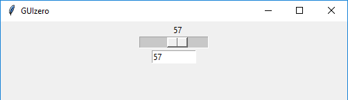

======
Slider
======

L'oggetto `Slider` visualizza una barra e un selettore per specificare un valore in un certo intervallo.

.. image:: images/slider_windows.png

Contiene un oggetto `tkinter.Scale`:

.. code:: python

    __init__(
        self, 
        master, 
        start=0, 
        end=100, 
        horizontal=True, 
        command=None, 
        grid=None, 
        align=None, 
        visible=True, 
        enabled=None, 
        width=None, 
        height=None)

Per utilizzare un oggetto `Slider` basta scrivere un codice tipo questo:

.. code:: python

    from guizero import App, Slider
    app = App()
    slider = Slider(app)
    app.display()

Parametri iniziali
==================

Quando si crea un oggetto `Slider`, **si deve specificare un master** e poi eventualmente altri parametri opzionali. I parametri sono:

=========== ================ ========= ============ ========================================================================================
Parametro   Tipo             Default   Obbligatorio Descrizione
=========== ================ ========= ============ ========================================================================================
master      App, Window, Box           Yes          Il contenitore a cui la widget appartiene
align       string           None      No           Allineamento della widget nel suo contenitore: `"top"`, `"bottom"`, `"left"`, `"right"`.
command     function         None      No           La funzione da eseguire quando un'opzione viene selezionata
end         int              100                    Il valore massimo dello slider
grid        List             None      No           Coordinate `[x,y]` della widget. Solo con layout grid.
horizontal  boolean          True                   Se visualizzare lo slider in senso orizzontale (default) o verticale 
start       int              0                      Il valore minimo dello slider
visible     boolean          True      No           Visibilità della widget
enabled     boolean          None      No           Se la widget è abilitata oppure no.
width       size             None      No           Larghezza della widget in pixel, oppure `"fill"`
height      size             None      No           Altezza della widget in pixel, oppure `"fill"`
=========== ================ ========= ============ ========================================================================================

Metodi
======

Elenco alfabetico dei metodi disponibili nell'oggetto `Slider`:

after(time, command, args=None)
    *time (int), command (function name), args (list of arguments)*
    
    Programma una chiamata **singola** alla funzione indicata nel parametro `command` dopo `time` millisecondi.
        
    
cancel(command)
    *command (function name)*
    
    Cancella una chiamata programmata a `command`.
    

destroy()
    Distrugge la widget.
    

disable()
    Disabilita la Widget.
    
    
enable()
    Abilita la Widget.
    

focus()
    Da il focus alla Widget.
    
    
hide()
    Nasconde la widget.

repeat(time, command, args=None)
    *time (int), command (function name), args (list of arguments)*
    
    Programma una chiamata **ripetuta** alla funzione indicata nel parametro `command` dopo ogni `time` millisecondi.

resize(width, height)
    *width (int), height (int)*
    
    Imposta larghezza e altezza del Box.
    
    
show()
    Visualizza il Box se prima era stata nascosto con `hide()`.

update_command(command, args=None) 
    *command (function), args (list)*
    
    Aggiorna la funzione da chiamare quando si seleziona un'opzione.

Attributi
=========

Elenco degli attributi accessibili per l'oggetto `Slider`:

=========== ================ ========================================================================================
Parametro   Tipo             Descrizione
=========== ================ ========================================================================================
align       string           Allineamento della widget nel suo contenitore: `"top"`, `"bottom"`, `"left"`, `"right"`.
bg          color            Il colore di sfondo della widget
enabled     boolean          Se la widget è abilitata oppure no.
font        string           Nome del font da utilizzare nella widget
grid        List             Coordinate `[x,y]` della widget. Solo con layout grid.
height      size             Altezza della widget in pixel, oppure `"fill"`.
items       List             Lista degli elementi visualizzati nella widget
master      App, Window, Box Il contenitore a cui la widget appartiene
text_size   int              Dimensione del font da utilizzare nella widget
text_color  color            Colore del font da utilizzare nella widget
value       string           Il valore corrente dello `Slider`
visible     boolean          Visibilità della widget
width       size             Larghezza della widget in pixel, oppure `"fill"`
=========== ================ ========================================================================================

Esempi
======

**Calling a function when the slider value changes**

Puoi decidere di chiamare una funzione quando lo slider cambia valore. La funzione **deve avere almeno un parametro** che riceverà automaticamente una stringa
contenente il valore dello slider.

.. code:: python

    from guizero import App, Slider, TextBox
    def slider_changed(slider_value):
        textbox.value = slider_value

    app = App()
    slider = Slider(app, command=slider_changed)
    textbox = TextBox(app)
    app.display()

