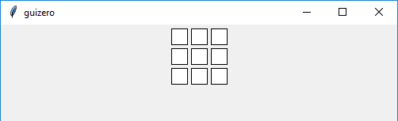

======
Waffle
======

L'oggetto `Waffle` visualizza una griglia n x n di quadrati con dimensioni e padding a scelta.

Contiene un oggetto `tkinter.Frame`

.. code:: python

    __init__(
        self, 
        master, 
        height=3, 
        width=3, 
        dim=20, 
        pad=5, 
        color="white", 
        dotty=False, 
        grid=None, 
        align=None, 
        command=None, 
        remember=True, 
        visible=True, 
        enabled=None, 
        bg=None)

Per utilizzare un oggetto `Waffle` basta scrivere un codice tipo questo:

.. code:: python

    from guizero import App, Waffle
    app = App()
    waffle = Waffle(app)
    app.display()

Parametri iniziali
==================

Quando si crea un oggetto `Waffle`, **si deve specificare un master** e poi eventualmente altri parametri opzionali. I parametri sono:

=========== ================ ========= ============ ========================================================================================
Parametro   Tipo             Default   Obbligatorio Descrizione
----------- ---------------- --------- ------------ ----------------------------------------------------------------------------------------
master      App, Window, Box           Yes          Il contenitore a cui la widget appartiene
align       string           None      No           Allineamento della widget nel suo contenitore: `"top"`, `"bottom"`, `"left"`, `"right"`.
color       color            white                  Il colore di default dello `Waffle`
command     function         None                   La funzione da chiamare quando il testo cambia (con ZERO oppure 1 argomento: il testo)
dim         int              20                     Quanto è largo ognuno dei riquadri dello `Waffle`
dotty       boolean          False                  Se i pixel visualizzano punti (True) oppure quadrati (False)
grid        List             None      No           Coordinate `[x,y]` della widget. Solo con layout grid.
height      size             3         No           Altezza della widget in pixel, oppure `"fill"`
pad         int              3                      Quanto spazio è presente fra ogni pixel del Waffle.
width       size             5         No           Larghezza della widget in pixel, oppure `"fill"`
visible     boolean          True      No           Visibilità della widget
enabled     boolean          None      No           Se la widget è abilitata oppure no.
bg          color            None      No           Il colore di sfondo del `Waffle`
=========== ================ ========= ============ ========================================================================================

Metodi
======

Elenco alfabetico dei metodi disponibili nell'oggetto `Waffle`:

after(time, command, args=None)
    *time (int), command (function name), args (list of arguments)*
    
    Programma una chiamata **singola** alla funzione indicata nel parametro `command` dopo `time` millisecondi.
        

cancel(command)
    *command (function name)*
    
    Cancella una chiamata programmata a `command`.
    

destroy()
    Distrugge la widget.
    

disable()
    Disabilita la Widget.
    
    
enable()
    Abilita la Widget.
    

focus()
    Da il focus alla Widget.
    

get_all()
    Ritorna i colori dei pixel come una lista 2D.
    
    
get_pixel(x, y)
    *x (int), y (int)*
    
    Ritorna il colore del pixel alle coordinate indicate.

    
hide()
    Nasconde la widget.

    
pixel(x, y)
    *x (int), y (int)*
    
    Ritorna il pixel alle coordinate indicate.
    
    
repeat(time, command, args=None)
    *time (int), command (function name), args (list of arguments)*
    
    Programma una chiamata **ripetuta** alla funzione indicata nel parametro `command` dopo ogni `time` millisecondi.

    
set_all(color)
    *color*
    
    Imposta tutti i pixel al colore indicato.
    

set_pixel(x, y, color)
    *x (int), y (int), color*
    
    Imposta al colore indicato il pixel alle coordinate indicate.
    
    
show()
    Visualizza il Box se prima era stata nascosto con `hide()`.

update_command(command)
    *command (function)*
    
    Aggiorna il nome della funzione da chiamare quando il testo viene modificato.

Attributi
=========

Elenco degli attributi accessibili per l'oggetto `Waffle`:

=========== ================ ========================================================================================
Parametro   Tipo             Descrizione
----------- ---------------- ----------------------------------------------------------------------------------------
align       string           Allineamento della widget nel suo contenitore: `"top"`, `"bottom"`, `"left"`, `"right"`.
bg          color            Il colore di sfondo della widget
color       color            Il colore di default dei pixel
dotty       boolean          pixel in punti (True) oppure in quadrati (False)
enabled     boolean          Se la widget è abilitata oppure no.
grid        List             Coordinate `[x,y]` della widget. Solo con layout grid.
height      size             Altezza della widget in pixel, oppure `"fill"`.
master      App, Window, Box Il contenitore a cui la widget appartiene
pad         int              La dimensione del padding fra i pixel
pixel_size  int              La dimensione di 1 pixel
visible     boolean          Visibilità della widget
width       size             Larghezza della widget in pixel, oppure `"fill"`
=========== ================ ========================================================================================

Esempi
======

**Set a pixel colour**

.. code:: python

    from guizero import App, Waffle

    app = App()

    my_waffle = Waffle(app)
    my_waffle[2,1].color = "red"

    # Your waffle will remember what colour each pixel is
    print(my_waffle[2,1].color)

    # Even the ones auto-set at the start (which are white by default)
    print(my_waffle[1,1].color)

    app.display()

WafflePixel
===========

.. code:: python

    from guizero import App, Waffle

    app = App()

    my_waffle = Waffle(app)
    my_waffle.pixel(x,y).color = "red"
    my_waffle[x,y].dotty = True

    app.display()

Attributi
=========

Elenco degli attributi accessibili per l'oggetto `WafflePixel`:

=========== ================ ========================================================================================
Parametro   Tipo             Descrizione
----------- ---------------- ----------------------------------------------------------------------------------------
x           int              coordinata x del pixel nella widget
y           int              coordinata y del pixel nella widget
canvas_x    int              coordinata x del pixel nel canvas
canvas_y    int              coordinata y del pixel nel canvas
color       color            Il colore di default dei pixel
dotty       boolean          pixel in punti (True) oppure in quadrati (False)
size        int              dimensione del pixel
=========== ================ ========================================================================================

